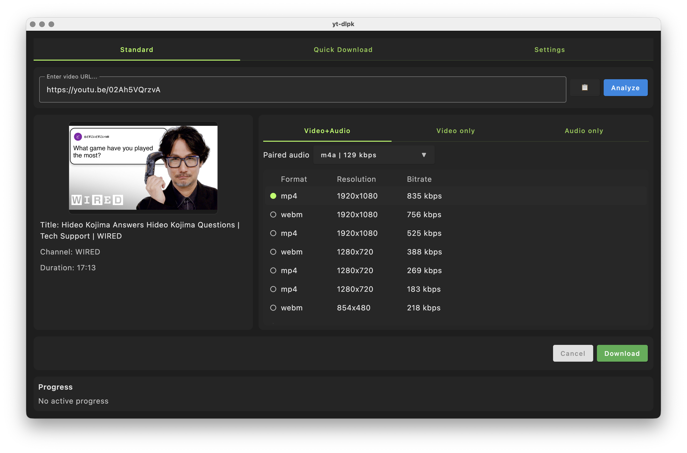

# yt-dlpk

`yt-dlpk` は、動画や音声をシンプルに保存できるデスクトップアプリです。
リンクを貼って、画質/音質を選んで、ダウンロードするだけの流れで使えます。

言語別README:
- [英語](./README.md)
- [日本語](./README.ja.md)
- [韓国語](./README.ko.md)

## できること

- 動画リンクを解析して、タイトル/チャンネル/サムネイルを確認
- 画質・音質ごとにフォーマットを選択
- 動画+音声 / 動画のみ / 音声のみ で保存
- 字幕の保存（対応している場合）
- プレイリスト全体または単体動画の保存
- 保存先フォルダとファイル名ルールの設定
- 進捗確認と途中キャンセル

## 使い方

1. アプリを起動します。
2. 保存したい動画URLを貼り付けます。
3. `Analyze` をクリックします。
4. 希望するフォーマット（画質/音質）を選びます。
5. 必要に応じてオプションを設定します。
   - 字幕保存
   - 音声抽出形式
   - プレイリスト全体保存の有無
   - 保存先フォルダ/ファイル名
6. `Download` をクリックして保存を開始します。
7. 進捗を確認し、必要なら途中でキャンセルできます。

## はじめて使う方へ

- まずは短い動画1本で設定を試すのがおすすめです。
- 保存先フォルダを先に決めておくと管理しやすくなります。
- プレイリストURLでは、全体保存の設定を必ず確認してください。

## 注意

- 利用可否は、動画サイト側の対応状況やコンテンツ状態に依存します。
- 年齢制限・地域制限・アクセス権限により保存できない動画があります。
