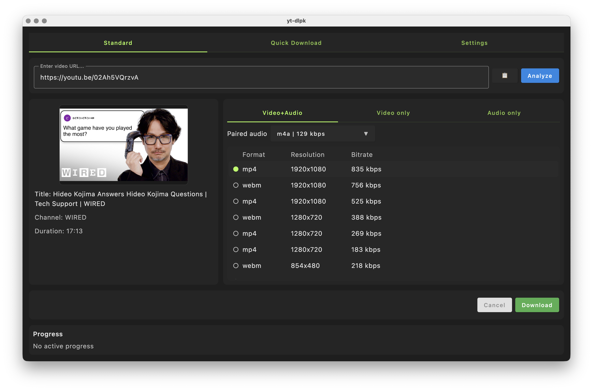

# yt-dlpk

`yt-dlpk` is a desktop app that helps you save videos and audio with a simple flow.
Paste a link, choose quality, and download.



Language versions:
- [English](./README.md)
- [Japanese](./README.ja.md)
- [Korean](./README.ko.md)

## What You Can Do

- Analyze a video link and preview title/channel/thumbnail
- Choose video or audio quality formats
- Download as video+audio, video-only, or audio-only
- Save subtitles (when available)
- Download a full playlist or only one item
- Set output folder and filename template
- Track progress and cancel anytime

## Recommended Setup

`yt-dlpk` uses working system tools first. Missing `yt-dlp`, `ffmpeg`/`ffprobe`, and Deno (the YouTube JavaScript runtime) are downloaded into `~/.yt-dlpk/tools/bin`; they are not embedded in the application package. Initial setup needs an internet connection. macOS downloads match Intel or Apple Silicon. See [tool management](docs/tool-management.md) for sources and update behavior.

macOS with Homebrew:

```sh
brew install yt-dlp ffmpeg deno
```

Windows with winget:

```powershell
winget install yt-dlp.yt-dlp
winget install Gyan.FFmpeg
```

Windows with Chocolatey:

```powershell
choco install yt-dlp ffmpeg
```

## How To Use

1. Launch the app.
2. Paste the video URL.
3. Click `Analyze`.
4. Select your preferred format/quality.
5. Set options if needed:
   - subtitles
   - audio extraction format
   - playlist all vs single item
   - output folder and filename
6. Click `Download`.
7. Check progress and cancel if needed.

## Tips

- Start with one short video to confirm your settings.
- Set your output folder first so files are easy to find.
- For playlist links, double-check whether `playlist all` is enabled.

## Local Build

JDK 25 is required.

Run tests:

```sh
./gradlew desktopTest
```

Run the app locally:

```sh
./gradlew run
```

Build a release package for the current OS:

```sh
./gradlew packageReleaseDistributionForCurrentOS
```

## Notes

- This app internally uses `yt-dlp` and `ffmpeg` for analysis and downloads.
- Official support is for Windows and macOS.
- Linux execution is not guaranteed.
- Availability depends on site support and content status.
- Some videos may be unavailable due to age/region/access restrictions.
